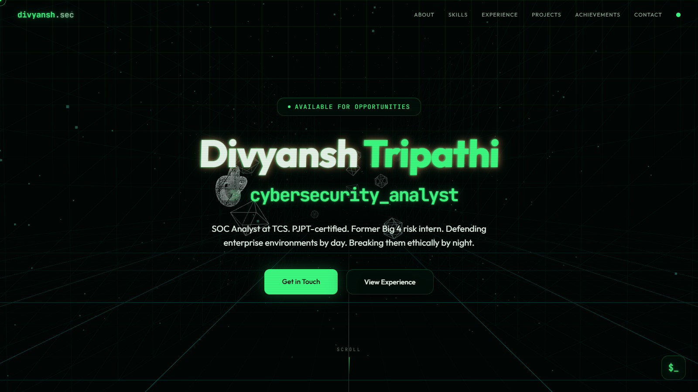

# Divyansh Tripathi — Cyber Portfolio

A scroll-driven, fully 3D personal portfolio with a hacker / green-CRT aesthetic.
A persistent WebGL world sits behind the content — you fly through a digital trench
as you scroll — complete with a working in-page terminal.

> **Live:** _add your Vercel URL here after deploying, e.g._ `https://portfolio-divytr.vercel.app`



---

## Features

- **Scroll-driven 3D camera** — the camera flies along a curved trench path mapped to scroll position (React Three Fiber + drei).
- **Living background** — Tron-style infinite grid, tilted "matrix rain" particles, and floating wireframe geometry, all with volumetric fog for depth.
- **Interactive terminal HUD** — type `help`, `whoami`, `scan`, `sentinelbench`, `projects`, `sudo`, and more.
- **CRT aesthetic** — green glow, scanlines, flicker, glitch title, cipher/typewriter text effects, and a custom dual-ring cursor.
- **DivyOS boot sequence** on first load.
- **Single source of content** — every word on the site lives in [`src/data/content.ts`](src/data/content.ts).
- **Graceful degradation** — falls back to a static CSS backdrop if WebGL is unavailable, and respects `prefers-reduced-motion`.
- **Fully responsive** and accessible-minded.

## Tech stack

| Area | Tech |
|---|---|
| Framework | React 19 + TypeScript |
| Build | Vite 6 |
| Styling | Tailwind CSS v4 (oklch design tokens) |
| 3D | three.js · @react-three/fiber · @react-three/drei |
| Fonts | Outfit + JetBrains Mono |

No backend, no SSR — it builds to static files and hosts anywhere.

## Getting started

Requires **Node 18+**.

```bash
# install dependencies
npm install

# start the dev server (http://localhost:5173)
npm run dev

# type-check + production build -> dist/
npm run build

# preview the production build locally
npm run preview
```

## Editing content

All text (roles, projects, skills, certs, contact, boot lines) is centralized in
**[`src/data/content.ts`](src/data/content.ts)**. Edit that one file and everything
re-renders — no need to touch component markup.

## Project structure

```
src/
├── data/content.ts        # ← all site content lives here
├── three/                 # the WebGL world
│   ├── CyberScene.tsx      #   <Canvas> composition + fog
│   ├── CameraRig.tsx       #   scroll-driven camera on a curve
│   ├── MatrixRain.tsx      #   falling particle field
│   ├── FloatingGeometry.tsx#   rotating wireframe solids
│   ├── Trench.tsx          #   grid floor/ceiling + walls
│   └── palette.ts          #   scene colors
├── components/
│   ├── sections/          # Hero, About, Skills, Experience, …
│   ├── ui/                # Panel, Cipher, Typewriter, Section…
│   ├── TerminalHUD.tsx    # the in-page terminal
│   ├── BootScreen.tsx     # DivyOS boot sequence
│   └── …                  # Header, cursor, scroll bar, scene boundary
├── hooks/                 # scroll progress + reveal-on-view
└── styles.css             # design system (tokens, CRT utilities)
```

> `legacy/index.html` is the original single-file static portfolio, preserved for reference.

## Deployment

Any static host works. Build command `npm run build`, output directory `dist`.

- **Vercel / Netlify / Cloudflare Pages** — import the repo; the Vite preset auto-fills the settings. Every push redeploys.

## License

© 2026 Divyansh Tripathi. All rights reserved.

---

<sub>Built with React + Three.js.</sub>
